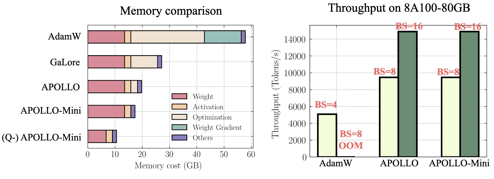

# 🚀 APOLLO: SGD-like Memory, AdamW-level Performance

### [[paper]](https://arxiv.org/abs/2412.05270) [[Project Page]](https://zhuhanqing.github.io/APOLLO/)


## 💡 Quick Introduction!

We introduce **APOLLO** (Approximated Gradient Scaling for Memory Efficient LLM Optimization), a novel method designed to optimize the memory efficiency of training large language models (LLM), offering **SGD-like memory cost** while delivering **AdamW-level performance** for pre-training!

---

### 🔍 Method

APOLLO effectively integrates two major ideas for memory-efficient LLM training: **low-rank approximation** (GaLore) and **optimizer state redundancy reduction** (Adam-mini). However, APOLLO takes memory efficiency to a new level, achieving **significant memory savings** (below GaLore and its variants, and close to SGD) while maintaining or surpassing the performance of Adam(W).

Our key contributions include:

- **Structured Learning Rate Updates for LLM Training**:  We identify that structured learning rate updates, such as channel-wise or tensor-wise scaling, are sufficient for LLM training. This approach explores *redundancy in AdamW's element-wise learning rate update rule*, forming a basis for our APOLLO method.

- **Approximated Channel-wise Gradient Scaling in a Low-Rank Auxiliary Space (APOLLO)**:  
  APOLLO proposes a practical and memory-efficient method to approximate channel-wise gradient scaling factors in an auxiliary low-rank space using **pure random projections**. This method achieves superior performance compared to AdamW, even with lower-rank approximations, while maintaining excellent memory efficiency.

- **Minimal-Rank Tensor-wise Gradient Scaling (APOLLO-Mini)**:  
  APOLLO-Mini introduces extreme memory efficiency by applying tensor-wise gradient scaling using only **a rank-1 auxiliary sub-space**. This results in SGD-level memory costs while outperforming AdamW, showcasing the effectiveness of the approach.

---

### Framework Overview
<div align="center">
  
</div>

*Figure 1: The APOLLO Framework for Memory-Efficient LLM Training. The channel-wise or tensor-wise gradient scaling factor is obtained via an auxiliary low-rank optimizer state, constructed using pure random projection (no SVD required).*

---

### Benefits and Results
<div align="center">
  
</div>

*Figure 2: System Benefits of APOLLO for Pre-training LLaMA 7B. (left): Memory breakdown comparison for a single batch size; (right): End-to-end training throughput on 8 A100-80GB GPUs*


## 💪To-Do List

- \[ \] Offical APOLLO release is on the way
- \[ \] APOLLO combined with int8 weight quantization from Q-Galore

## 🔥 News

- [2024/12] [[Paper]](https://arxiv.org/abs/2412.05270) is on arXiv!

## 📚 Abstract
Large language models (LLMs) demonstrate remarkable capabilities but are notoriously memory-intensive during training, particularly with the popular Adam optimizer. This memory burden often necessitates using more GPUs, smaller batch sizes, or high-end hardware, thereby limiting scalability and training efficiency. To address this, various memory-efficient optimizers have been proposed to reduce optimizer memory usage. However, they face key challenges: (i) reliance on costly SVD operations (e.g., GaLore, Fira); (ii) significant performance trade-offs compared to AdamW (e.g., Flora); and (iii) still substantial memory overhead of optimization states in order to maintain competitive performance (e.g., 1/4 rank in Galore, and full-rank first momentum in Adam-mini).

In this work, we investigate the redundancy in Adam's learning rate adaption rule and identify that it can be coarsened as a structured learning rate update (channel-wise or tensor-wise).
Based on this insight, we propose a novel approach, ***Ap***proximated Gradient Scaling for Mem***o***ry Efficient ***LL***M ***O***ptimization (**APOLLO**), which approximate the channel-wise learning rate scaling with an auxiliary low-rank optimizer state based on pure ***random projection***.
The structured learning rate update rule makes APOLLO highly tolerant to further memory reduction with lower rank, halving the rank while delivering similar pre-training performance.
We further propose an extreme memory-efficient version, APOLLO-mini, which utilizes tensor-wise scaling with only a rank-1 auxiliary sub-space, achieving ***SGD-level memory cost*** but superior pre-training performance than Adam(W).

We conduct extensive experiments across different tasks and model architectures, showing that APOLLO series performs **generally on-par with, or even better than Adam(W)**. Meanwhile, APOLLO  achieves **even greater memory savings than Galore**, by almost eliminating the optimization states in AdamW.
These savings translate into significant system benefits:
*  **Enhanced Throughput**: APOLLO and APOLLO-mini achieve up to 3x throughput on a 4xA100-80GB setup compared to Adam by fully utilizing memory to support 4x larger batch sizes.
* **Improved Model Scalability**: APOLLO-mini ***for the first time***  enables pre-training LLaMA-13B model with naive DDP on A100-80G without requiring other system-level optimizations
* **Low-End GPU Pre-training**: Combined with quantization, the APOLLO series ***for the first time*** enables the training of LLaMA-7B from scratch using less than 12 GB of memory. 

## 📬 Contact

For questions or collaboration inquiries, feel free to reach out our core contributors:

- 📧 Email: [hqzhu@utexas.edu](mailto:hqzhu@utexas.edu)
- 📧 Email: [zhenyu.zhang@utexas.edu](mailto:zhenyu.zhang@utexas.edu)


## 📖 Citation

If you find APOLLO useful in your work, please consider citing our paper:

```bibtex
@misc{zhu2024apollosgdlikememoryadamwlevel,
      title={APOLLO: SGD-like Memory, AdamW-level Performance}, 
      author={Hanqing Zhu and Zhenyu Zhang and Wenyan Cong and Xi Liu and Sem Park and Vikas Chandra and Bo Long and David Z. Pan and Zhangyang Wang and Jinwon Lee},
      year={2024},
      eprint={2412.05270},
      archivePrefix={arXiv},
      primaryClass={cs.LG},
      url={https://arxiv.org/abs/2412.05270}, 
}
```
